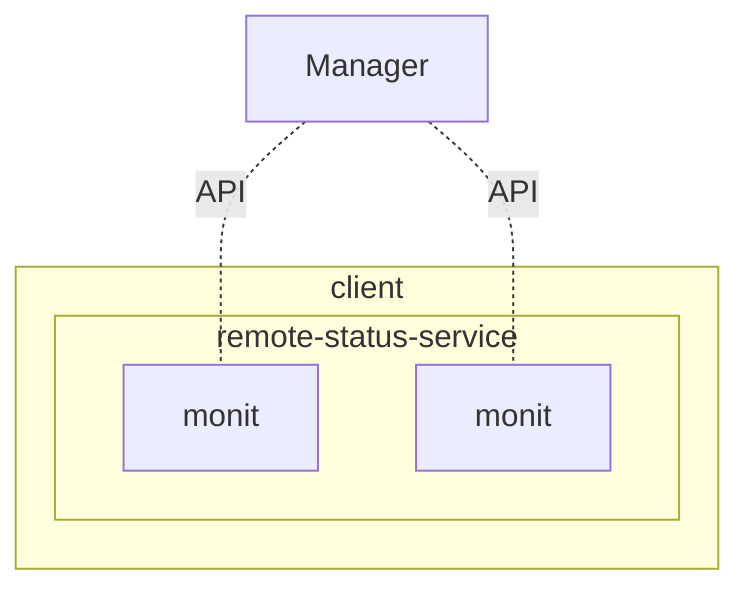
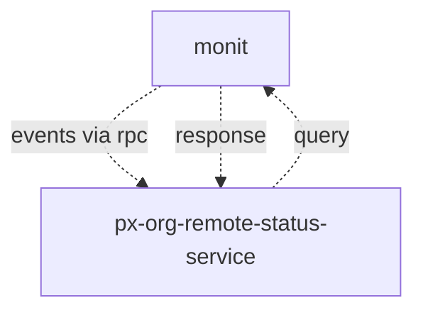

# PantherX Organization Remote Status Service

In order to gain better insights in device usage and utilization, and receive alerts when certain thresholds are reached, we continuously monitor all clients. Some of the stats we track include:

- CPU Usage
- Disk Usage
- Network Usage
- Software Version
- Backup Status
- Errors
- Breech (system files modified)

## Overview


---


_Notes_

- `px-org-remote-status-service` is C/C++ based
- We rely on [Monit](https://mmonit.com/monit/) for monitoring   
- `px-org-remote-status-service` basically "forwards" (read or receive from `monit`) the data   
- `px-org-remote-status-service` sends data to _Central Management_ at `/api/v1/devices/stats`
- this is the only service, that has API (submit) access from *device* side   
- stats are colleted on a **X** interval
- Stats should be stored(sqlite), until they are successfully send
- Events should be determined in config file (`monitrc`).
- Events should be stored, if they fail to send.

### `monit` query response example

```
System 'fakhri-VirtualBox'
  status                       OK
  monitoring status            Monitored
  monitoring mode              active
  on reboot                    start
  load average                 [0.15] [0.12] [0.09]
  cpu                          6.2%us 1.0%sy 0.9%wa
  memory usage                 1.3 GB [45.6%]
  swap usage                   0 B [0.0%]
  uptime                       2h 34m
  boot time                    Sat, 13 Apr 2019 11:24:17
  data collected               Sat, 13 Apr 2019 13:58:46
```

### `monit` configuration event example

```
if cpu usage > 95% for 10 cycles then exec "/my/script"
```

## Build

- Install `Monit`

### Build restclient-cpp

```bash
git clone https://github.com/mrtazz/restclient-cpp.git
cd restclient-cpp
./autogen.sh
./configure
sudo make install
```

### Build px-org-remote-status-service

```bash
git clone https://git.pantherx.org/development/applications/px-org-remote-status-service.git
cd px-org-remote-status-service
mkdir build
cd build
cmake ..
make
sudo make install
```
